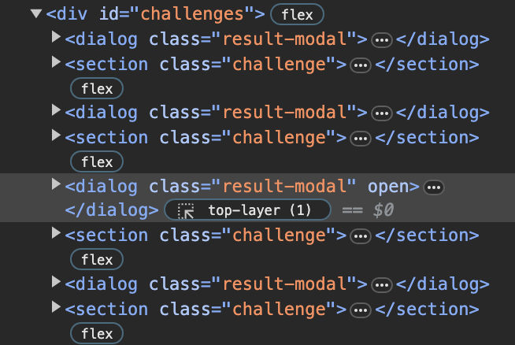
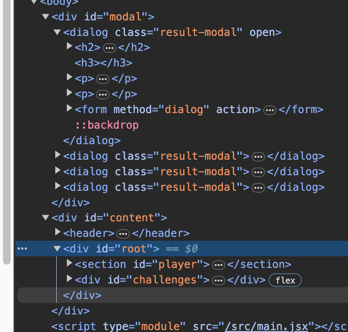

# useRef & Portals

1. useRef()

- 참조 = 특정 컴포넌트 인스턴스에만 할당됨
- props 나 변수의 경우 한 컴포넌트가 해당 값을 공유할 수 있음

|        구분        |                                               useState()                                                |                     useRef()                     |
| :----------------: | :-----------------------------------------------------------------------------------------------------: | :----------------------------------------------: |
|        특징        |          상태값들은 상태 업데이트 함수를 통해 변화가 이루어졌을때, 컴포넌트의 재실행을 일으킴           | 참조값이 바뀌어도, 컴포넌트들이 재실행되지 않음. |
| 사용 목적 및 범위  |                                UI에 바로 반영되어야하는 값이 있을때 사용                                |     DOM 요소에 직접적인 접근이 필요할 때(?)      |
| 권장하지 않는 범위 | 시스탬 내부에 보이지 않는 쪽에서만 다루는 값들이나 UI에 직접적인 영향을 끼지지 않는 값들을 갖고있을경우 |                                                  |

2. forwardRef

- 함수 바깥쪽에서 함수로 제어하면 유지보수 및 관리가 어려움. 그래서 안쪽에서 함수를 만들어 제어할 수 있도록 작업.

  ```jsx
  // forwardRef랑 짝꿍이며, 재사용가능하게 만들어줌
    useImperativeHandle(ref, () => {return {
      속성과 메소드들은 해당 컴포넌트나 다른 컴포넌트에 노출되어야하는 것들
    }})
  ```

3. createPortal

- 이 컴포넌트에 렌더링이될 HTML을 DOM 내의 다른곳으로 옮기는 것.
- 기본 index.html 에 createPortal이 들어갈 html을 생성.
  ex) 모달 등 컴포넌트 내. 말고 다른 위치에 위치하고 싶은 컨텐츠를 html로 지정한 위치로 랜더링 시키는 기능.

  - 사용법

  1. createPortal 가져오기

  ```jsx
  import { createPortal } from "react-dom";
  ```

  2. createPortal 로 해당 컴포넌트 감싸기

  ```jsx
  export default function Modal({ children }) {
    return createPortal(<dialog>{children}</dialog>); //   return createPortal(jsx코드, HTML요소);
  }
  ```

  3. 위치시킬 위치 선정

  ```jsx
  return createPortal(
    <dialog>{children}</dialog>,
    document.getElementById("modal-root") // #modal-root 에 해당 모달 설치
  );
  ```

  
  
